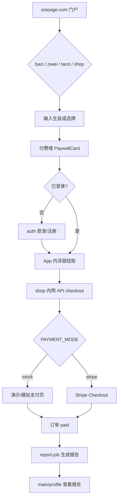

# OraSage（orasage.com）产品体验评估与测试用例设计

> **文档版本：** 2026-07-03  
> **依据：** `README.md`、`PRODUCT_PLAN_v3.md`（若存在）、`docs/mobile-first.md`、`docs/HANDOFF-orasage-platform.md` 及核心代码  
> **范围：** 8 个子域模块全平台 UX 评估 + 可执行测试用例  
> **自动化入口：** `scripts/e2e/`（见 [§4 自动化映射](#4-自动化脚本与用例映射)）

---

## 平台概览（8 模块）

| 子域 | 模块 | 核心职责 |
|------|------|----------|
| orasage.com | main | 12 语言门户、用户中心、内容入口 |
| auth.orasage.com | auth | 统一注册/登录、JWT 签发、readings/orders 聚合 |
| shop.orasage.com | shop | 水晶/报告/咨询商品、结账、Mock/Stripe 支付 |
| admin.orasage.com | admin | 运营后台（骨架，需 `role=admin`） |
| bazi.orasage.com | bazi | 八字排盘、AI 报告、Manus OAuth + orasage 桥接 |
| ziwei.orasage.com | ziwei | 紫微斗数、合盘、付费 AI 解读 |
| tarot.orasage.com | tarot | 塔罗占卜、神庙功德、水晶推荐 |
| cms.orasage.com | cms | Payload CMS 内容管理（骨架） |

**核心商业闭环：**

发现（main）→ 测算（bazi/ziwei/tarot）→ 付费解锁（shop 内网 API）→ 支付（mock/Stripe）→ 报告生成/功德到账 → 用户中心查看（main/profile）

---

## 第一步：用户体验（UX）与路径分析

### 1.1 核心路径闭环评估

#### ✅ 已闭环的路径

| 路径 | 闭环程度 | 说明 |
|------|----------|------|
| 门户发现 → 命理测算 | 高 | main 首页卡片直达各子域；ziwei/tarot 支持匿名测算 |
| 注册/登录 → 跨子域会话 | 高 | `orasage_token`（`.orasage.com`）实现单点登录 |
| 测算 → 付费 → 报告 | 中高 | bazi/ziwei 有 PaywallCard → checkout → report-job 管线；**2026-07-03 生产 E2E 已跑通** |
| 商城直接购买 | 中 | shop 独立结账，需登录（mock 模式） |
| 用户中心聚合 | 中 | main `/profile` 展示 readings/orders（Phase 2 UI 已统一）；依赖各 App sync |

#### ⚠️ 未完全闭环的路径

| 路径 | 问题 |
|------|------|
| 命理 App 登录态感知 | 后端桥接已完成，前端**未展示「已通过 orasage 登录」**（README P1 遗留） |
| bazi 双轨登录 | Manus OAuth 与 orasage 桥接并存，用户可能不清楚当前用哪种身份 |
| tarot 访客 → 正式账号 | 访客 `tarot_token` 与 orasage 账号的合并/迁移路径不清晰 |
| admin/cms 运营 | 骨架状态，无法完成真实运营管理闭环 |
| 支付后回跳 | 依赖 `return=` 参数，部分 App 回跳失败时用户可能「付了钱却看不到结果」 |

#### 核心路径图（逻辑）



### 1.2 高风险流失点（Drop-off Points）

| 优先级 | 流失点 | 场景 | 风险原因 |
|--------|--------|------|----------|
| P0 | 跨子域登录跳转 | bazi 点「登录」→ auth → 回跳失败 | redirect 白名单、`secure` Cookie 在 HTTP 本地失效 |
| P0 | 付费墙前的登录门槛 | 匿名用户见 PaywallCard 不知为何要登录 | 命理 App 前端未展示登录状态 |
| P0 | 支付后回跳丢失 | mock 支付完成但 `return=` 丢失 | 用户付了钱却留在 shop，不知报告在哪 |
| P1 | 生辰输入门槛 | 八字/紫微需精确时辰 | WheelPicker 繁琐；时辰不确定时放弃 |
| P1 | 语言切换断层 | main 12 语言 vs 命理 App 部分语言 | 非中文用户语言不一致 |
| P1 | bazi 双登录体系 | Manus OAuth 与 orasage 并存 | 身份来源混淆 |
| P2 | 商城与测算割裂 | 水晶在结果页，商城独立子域 | 用户不理解跨站购买 |
| P2 | 报告生成等待 | LLM 数秒～数十秒 | 无进度提示时以为支付失败 |
| P2 | tarot 功德体系 | 神庙/功德逻辑复杂 | 新用户不理解与水晶购买关系 |

### 1.3 易用性与直观性优化建议

**移动端（首要，见 `docs/mobile-first.md`）**

| 建议 | 针对模块 | 具体措施 |
|------|----------|----------|
| 统一 App Shell | bazi/ziwei/tarot | `shared/app-shell/` 底栏、返回在所有子页一致 |
| 触控目标 ≥ 44px | 全平台 | 付费按钮、牌阵、WheelPicker 加大点击区 |
| 生辰输入简化 | bazi/ziwei | 「不知道时辰」+ 默认午时；通讯录/日历导入 |
| 付费墙文案 | bazi/ziwei/tarot | 明确「解锁后可获得什么」+ 价格 + 预计等待 |
| 登录态可见 | 命理三 App | 顶部头像/邮箱，跳转 profile 或登出 |

**Web 端**

| 建议 | 说明 |
|------|------|
| 门户多栏布局 | main 在 `lg:` 展示工具 + 商城 + 内容三栏 |
| 用户中心 IA | profile 按测算/订单/报告/设置分组（Phase 2 已部分落地） |
| admin 权限提示 | 非 admin 访问时明确无权限页 |

**跨模块一致性**

| 建议 | 说明 |
|------|------|
| 设计语言统一 | `shared/design-tokens/orasage-tokens.css`（v1.1 纸感 + jade/brass）；auth 静态 CSS sync |
| 支付流程统一 | App 内浮层 + shop 内网 API，避免整页跳 shop |
| 错误提示统一 | 网络/登录过期/支付失败同一套文案与重试 |
| 回跳成功反馈 | Toast「支付成功，报告生成中…」+ 进度 |

---

## 第二步：标准业务流测试（Happy Path）

以下用例覆盖平台级核心闭环，按模块分组。执行方式：**M**=手工，**A**=已有自动化（见 §4）。

### 2.1 统一认证（auth）

#### TC-AUTH-001：新用户注册并跨子域保持登录 `[P0]` `[A]`

| 字段 | 内容 |
|------|------|
| 测试目的 | 验证注册流程及 Cookie 跨子域生效 |
| 前置条件 | 无账号；浏览器 Cookie 已清空 |
| 操作步骤 | 1. 访问 `https://bazi.orasage.com` 2. 触发需登录操作 3. 跳转 `auth.orasage.com/register?redirect=…` 4. 注册 5. 回跳 bazi 6. 新标签打开 `ziwei.orasage.com` |
| 预期结果 | 1. 设置 `orasage_token`（`domain=.orasage.com`）2. 回跳原页 3. ziwei 识别已登录（`GET /api/auth/me` 有用户） |

#### TC-AUTH-002：已登录用户访问用户中心 `[P1]` `[M]`

| 字段 | 内容 |
|------|------|
| 前置条件 | 已登录 |
| 操作步骤 | 访问 `https://auth.orasage.com/center` |
| 预期结果 | 302 → `https://orasage.com/zh-CN/profile`，展示邮箱、测算、订单 |

#### TC-AUTH-003：登录 redirect 白名单校验 `[P0]` `[M/A]`

| 字段 | 内容 |
|------|------|
| 操作步骤 | 1. `auth.orasage.com/login?redirect=https://evil.com` 登录 2. `redirect=javascript:alert(1)` |
| 预期结果 | 跳转默认 `orasage.com/zh-CN/profile`，不跳转 evil / javascript |
| 代码依据 | `auth-service/src/routes/pages.ts` → `safeRedirect()`，`ALLOWED_HOSTS` + `*.orasage.com` |

### 2.2 主门户（main）

#### TC-MAIN-001：多语言门户浏览与工具入口 `[P1]` `[M]`

访问 `orasage.com/en` → 切换 zh-CN → 点击八字/商城卡片 → 跳转对应子域。

#### TC-MAIN-002：用户中心查看聚合数据 `[P1]` `[A partial]`

| 字段 | 内容 |
|------|------|
| 前置条件 | 已登录；ziwei/bazi 完成测算并 sync |
| 操作步骤 | `orasage.com/zh-CN/profile/readings` → 点击「查看报告」 |
| 预期结果 | 列表含 reading；`report_url` 可打开 HTML |
| 自动化 | `scripts/e2e/profile-shop-flow.mjs`（bazi 单人+合盘 + Profile 链接） |

### 2.3 八字排盘（bazi）

#### TC-BAZI-001：匿名排盘 → 登录 → 付费 → 获取报告 `[P0]` `[A]`

完整浏览器闭环：排盘 → PaywallCard → mock 支付 → 报告 HTTP 200 → profile「查看报告」。

**自动化：** `npm run test:shop-flow`（`scripts/e2e/profile-shop-flow.mjs`）

#### TC-BAZI-002：orasage 桥接登录（不经过 Manus OAuth） `[P1]` `[M]`

| 代码依据 | `bazi/server/_core/sdk.ts` → `authenticateViaOrasageBridge()`，`openId=orasage:<sub>` |

### 2.4 紫微斗数（ziwei）

#### TC-ZIWEI-001：匿名单人排盘 `[P2]` `[M]`

访问 `ziwei.orasage.com/chart`，输入生辰，命盘渲染；匿名时 `/api/auth/me` 为 null。

#### TC-ZIWEI-002：双人合盘付费流程 `[P0]` `[A]`

合盘 → 付费 → 报告生成。自动化：`npm run test:ziwei-flow`。

#### TC-ZIWEI-003：`/heming` 重定向 `[P2]` `[M]`

`ziwei.orasage.com/heming` → 307 `/chart?mode=heming`。

### 2.5 塔罗占卜（tarot）

#### TC-TAROT-001：访客自动创建 + 每日一牌 `[P2]` `[M]`

#### TC-TAROT-002：神庙供奉 + 功德累积 `[P2]` `[M]`

#### TC-TAROT-003：水晶购买触发功德 `[P1]` `[A]`

**自动化：** `npm run test:tarot-offer`（`tarot-offer-merit.mjs`）；免费次数：`test:tarot-free`。

### 2.6 能量商城（shop）

#### TC-SHOP-001：商城直接购买水晶 `[P0]` `[M]`

#### TC-SHOP-002：内网 API 结账 `[P0]` `[A partial]`

API 级 checkout + pay：`platform-report-flow.mjs`。公网 POST `/api/checkout` 403：需单独 curl 用例（`shop/src/lib/internal.ts` → `isLocalRequest`，取 **X-Real-IP 末段** 防伪造）。

#### TC-SHOP-003：recommendationContext 传递 `[P1]` `[M]`

### 2.7 管理后台（admin）

#### TC-ADMIN-001 / 002 `[P2]` `[M]`

JWT `role=admin` 门控；普通用户 403。

### 2.8 CMS（cms）

#### TC-CMS-001 `[P3]` `[M]`

Payload 首次管理员；当前生产 cms 可能 502（见 backlog）。

---

## 第三步：异常流与极端情况测试（Edge Cases）

### 3.1 界面交互异常

| ID | 测试点 | 预期 |
|----|--------|------|
| UI-001 | 连续狂点「确认支付」 | 仅 1 笔 paid；无重复 report-job |
| UI-002 | 连续狂点「排盘」 | 不崩溃；reading sync 同 readingId 去重 |
| UI-003 | 快速切换合盘/单人 Tab | 表单状态正确 |
| UI-004 | 姓名字段 XSS | 转义，不执行脚本 |
| UI-005 | recommendationContext 超长 | 400（schema max） |
| UI-006 | 纯空格邮箱/密码 | 400，不创建空账号 |
| UI-007 | 子时交界 WheelPicker | 早/晚子时正确 |
| UI-008 | tarot 快速翻牌 | 当日结果固定 |
| UI-009 | 浮层结账点遮罩关闭 | 未创建订单 |
| UI-010 | 支付后浏览器后退 | 不重复扣款 |

### 3.2 网络与环境异常

| ID | 测试点 | 预期 |
|----|--------|------|
| NET-001 | 排盘中断网 | 友好错误，可重试 |
| NET-002 | 支付中断网 | 订单 pending，可重试 |
| NET-006 | auth 商品 catalog 不可用 | `FALLBACK_PRODUCTS` 降级 |
| NET-007 | report-job 超时 | 订单 paid；报告异步；profile「生成中」 |
| NET-008 | Stripe webhook 延迟 | 轮询或 webhook 后变 paid |

### 3.3 状态与并发异常

| ID | 测试点 | 预期 |
|----|--------|------|
| STATE-003 | 重复 sync 同一 readingId | auth 去重，1 条记录 |
| STATE-004 | JWT 过期后购买 | 跳转登录，回跳继续 |
| STATE-006 | tarot 访客转 orasage | **产品缺口**：功德是否合并未定义 |
| STATE-008 | 并发 report-job | 幂等，1 份报告 |

### 3.4 业务边界异常

| ID | 测试点 | 预期 |
|----|--------|------|
| BIZ-003 | 公网 POST shop `/api/checkout` | 403 |
| BIZ-004 | 公网 POST auth `/internal/*` | 403（Nginx + IP 白名单） |
| BIZ-008 | 内网 checkout 伪造 userId | shop POST 校验 cookie 与 body.userId 一致 |
| BIZ-009 | redirect 开放重定向 | `safeRedirect` 兜底 profile |
| BIZ-013 | 访问他人 report URL | 当前报告 URL 可公开访问（需产品决策是否加鉴权） |
| BIZ-015 | 本地 HTTP Cookie | `secure` 不写入；用 Bearer token 测 API |

### 3.5 跨模块集成异常

| ID | 测试点 | 预期 |
|----|--------|------|
| INT-001/002 | bazi/ziwei report-job 宕机 | 订单 paid；日志；可重试 |
| INT-004 | JWT_SECRET 不一致 | orasage 桥接失败 |

---

## 总结与测试优先级

| 优先级 | 测试范围 | 原因 |
|--------|----------|------|
| **P0** | TC-AUTH-001/003、TC-BAZI-001、TC-ZIWEI-002、TC-SHOP-001/002、UI-001、NET-002、BIZ-003/004/008 | 资金、跨域认证、内网 API |
| **P1** | TC-MAIN-002、TC-TAROT-003、NET-001/006/007、STATE-004/007/008 | 核心价值闭环 |
| **P2** | TC-TAROT-001/002、TC-ADMIN、UI-003–010 | 体验与稳定性 |
| **P3** | TC-CMS-001、BIZ-014/015 | 骨架与边缘 |

### 已知产品缺口（Expected Failure / Blocked）

1. ~~命理 App 前端未展示 orasage 登录态（README P1）~~ → `OrasageAuthChip` 已接入 bazi/ziwei/tarot App Shell
2. admin/cms 仅为骨架
3. 默认 `PAYMENT_MODE=mock`；Stripe 需单独环境
4. tarot 访客 → orasage 账号数据合并未定义
5. 报告 HTML 公开 URL 鉴权策略未统一

---

## 4. 自动化脚本与用例映射

在 `scripts/e2e/` 目录执行（需 `npm install` + Playwright Chromium）。

| 脚本 | npm script | 覆盖用例 | 类型 | 生产验证（2026-07-03） |
|------|------------|----------|------|------------------------|
| `platform-report-flow.mjs` | `test:platform-report` | TC-SHOP-002（API）、SKU 存在性 | API | ✅ |
| `profile-shop-flow.mjs` | `test:shop-flow` | TC-BAZI-001、TC-MAIN-002（partial） | Browser | ✅ |
| `ziwei-shop-flow.mjs` | `test:ziwei-flow` | TC-ZIWEI-002 | Browser | ✅ |
| `tarot-offer-merit.mjs` | `test:tarot-offer` | TC-TAROT-003 | API | ✅ |
| `tarot-free-readings.mjs` | `test:tarot-free` | tarot 免费次数 P2 | API | ✅ |
| `verify-unify.mjs` | （手动 `node`） | App Shell 底栏一致性 | Browser | ✅ |
| `auth-redirect-security.mjs` | `test:auth-redirect` | TC-AUTH-003 | Browser | ✅ |
| `auth-cross-domain.mjs` | `test:auth-sso` | TC-AUTH-001 | Browser | ✅ |
| `shop-checkout-security.mjs` | `test:shop-security` | BIZ-003 | API | ✅ |
| `auth-internal-forbidden.mjs` | `test:auth-internal` | BIZ-004 | API | ✅ |
| `shop-crystal-flow.mjs` | `test:shop-crystal` | TC-SHOP-001 | Browser | ✅ |
| `pay-double-click.mjs` | `test:pay-double` | UI-001 | Browser | ✅ |
| `run-smoke-all.mjs` | `test:smoke-all` | 全量生产冒烟（含 verify-unify） | mixed | ✅ |

**一键生产冒烟（推荐 CI）：**

```bash
cd scripts/e2e
npm install
npx playwright install chromium
npm run test:smoke-all
```

### 自动化缺口（待补脚本）

| 用例 ID | 说明 |
|---------|------|
| TC-AUTH-002 | auth `/center` → profile 302 |
| TC-TAROT-001/002 | 访客 daily-card / temple 浏览器流 |
| TC-ADMIN-* | admin 角色门控 |
| NET-002 | 支付中断网（需 Playwright 断网模拟） |

---

## 5. 与仓库现状对齐（代码核查摘要）

| 文档陈述 | 仓库状态（2026-07-03） |
|----------|------------------------|
| `orasage_token` 跨子域 SSO | ✅ `auth-service/src/lib/jwt.ts`，`.orasage.com` |
| redirect 白名单 | ✅ `safeRedirect()` in `pages.ts` |
| shop 内网 checkout | ✅ `isLocalRequest()` + cookie/userId 绑定 |
| bazi orasage 桥接 | ✅ `authenticateViaOrasageBridge` |
| ziwei 匿名 + 桥接 | ✅ `ziwei/lib/auth.ts` |
| mock 默认支付 | ✅ `shared/payments/mode.ts` |
| report SKU 分级 | ✅ auth `0007_report_plan_skus.sql` + shop fallback |
| Profile UI 统一 | ✅ Phase 2 已合入 main（`@orasage/ui`） |
| bazi 本地 shadcn 53 文件 | ✅ 已删，改 `@orasage/ui`（PR #52） |
| 命理 App 登录态 UI | ✅ `OrasageAuthChip` + ziwei `JWT_SECRET` 部署继承 |
| Playwright 全链路 | ✅ `npm run test:smoke-all`（2026-07-03 全绿） |

---

## 相关文档

- [`docs/HANDOFF-orasage-platform.md`](../HANDOFF-orasage-platform.md)
- [`docs/mobile-first.md`](../mobile-first.md)
- [`docs/design-system/ui-phase-2.md`](../design-system/ui-phase-2.md)
- [`docs/plans/design-unify-backlog.md`](../plans/design-unify-backlog.md)
- [`AGENTS.md`](../../AGENTS.md) — 本地运行与环境变量
